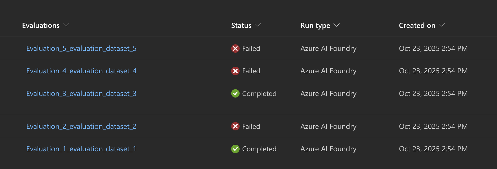

# Bug

This repo can be used to replicate an error in the `azure-ai-projects-1.1.0b4` SDK when running multiple cloud evals.

The error is error:

**Error during evaluation for run ID 1c8a7203-5c34-4a97-87c9-d599261017cb: (InternalError) I/O operation on closed file.**



```text
2025-10-24 14:27:09 | INFO     | xxx-xxx-xxx | dataMapping provided: {'query': '${data.query}', 'response': '${data.response}', 'context': '${data.context}'}
2025-10-24 14:27:09 | INFO     | xxx-xxx-xxx | dataMapping provided: {'query': '${data.query}', 'response': '${data.response}'}
2025-10-24 14:27:09 | INFO     | xxx-xxx-xxx | dataMapping provided: {'response': '${data.response}', 'ground_truth': '${data.ground_truth}'}
2025-10-24 14:27:09 | INFO     | xxx-xxx-xxx | dataMapping provided: {'response': '${data.response}', 'ground_truth': '${data.ground_truth}'}
2025-10-24 14:27:09 | INFO     | xxx-xxx-xxx | Execute evaluators with evaluators: ['relevance', 'violence', 'f1_score', 'rouge']
======= Run Summary =======

Run name: "rouge_20251024_142709_646831"
Run status: "Completed"
Start time: "2025-10-24 14:27:09.646831+00:00"
Duration: "0:00:01.002103"

======= Run Summary =======

Run name: "f1_score_20251024_142709_647049"
Run status: "Completed"
Start time: "2025-10-24 14:27:09.647049+00:00"
Duration: "0:00:01.001694"

2025-10-24 14:27:40 | ERROR    | xxx-xxx-xxx | Error during evaluation for run ID xxx-xxx-xxx: (InternalError) I/O operation on closed file.
Traceback (most recent call last):
  File "/opt/venv/lib/python3.10/site-packages/azure/ai/evaluation/_evaluate/_evaluate.py", line 792, in evaluate
    return _evaluate(
  File "/opt/venv/lib/python3.10/site-packages/azure/ai/evaluation/_evaluate/_evaluate.py", line 925, in _evaluate
    eval_result_df, eval_metrics, per_evaluator_results = _run_callable_evaluators(
  File "/opt/venv/lib/python3.10/site-packages/azure/ai/evaluation/_evaluate/_evaluate.py", line 1193, in _run_callable_evaluators
    per_evaluator_results: Dict[str, __EvaluatorInfo] = {
  File "/opt/venv/lib/python3.10/site-packages/azure/ai/evaluation/_evaluate/_evaluate.py", line 1195, in <dictcomp>
    "result": batch_run_client.get_details(run, all_results=True),
  File "/opt/venv/lib/python3.10/site-packages/azure/ai/evaluation/_evaluate/_batch_run/_run_submitter_client.py", line 95, in get_details
    run = self._get_run(client_run)
  File "/opt/venv/lib/python3.10/site-packages/azure/ai/evaluation/_evaluate/_batch_run/_run_submitter_client.py", line 166, in _get_run
    return cast(Future[Run], run).result()
  File "/opt/miniconda/lib/python3.10/concurrent/futures/_base.py", line 458, in result
    return self.__get_result()
  File "/opt/miniconda/lib/python3.10/concurrent/futures/_base.py", line 403, in __get_result
    raise self._exception
  File "/opt/miniconda/lib/python3.10/concurrent/futures/thread.py", line 58, in run
    result = self.fn(*self.args, **self.kwargs)
  File "/opt/miniconda/lib/python3.10/asyncio/runners.py", line 44, in run
    return loop.run_until_complete(main)
  File "/opt/miniconda/lib/python3.10/asyncio/base_events.py", line 649, in run_until_complete
    return future.result()
  File "/opt/venv/lib/python3.10/site-packages/azure/ai/evaluation/_legacy/_batch_engine/_run_submitter.py", line 83, in submit
    self.stream_run(run=run, storage=local_storage, raise_on_error=self._config.raise_on_error)
  File "/opt/venv/lib/python3.10/site-packages/azure/ai/evaluation/_legacy/_batch_engine/_run_submitter.py", line 208, in stream_run
    RunSubmitter._print_run_summary(run, file_handler)
  File "/opt/venv/lib/python3.10/site-packages/azure/ai/evaluation/_legacy/_batch_engine/_run_submitter.py", line 243, in _print_run_summary
    text_out.write(
  File "/opt/venv/lib/python3.10/site-packages/azure/ai/evaluation/_legacy/_common/_logging.py", line 255, in write
    return self._prev_out.write(s)
  File "/opt/venv/lib/python3.10/site-packages/azure/ai/evaluation/_legacy/_common/_logging.py", line 255, in write
    return self._prev_out.write(s)
  File "/opt/venv/lib/python3.10/site-packages/azure/ai/evaluation/_legacy/_common/_logging.py", line 255, in write
    return self._prev_out.write(s)
ValueError: I/O operation on closed file.

The above exception was the direct cause of the following exception:

Traceback (most recent call last):
  File "/app/evaluation/evaluation.py", line 44, in run_evaluation
    results = await execute_evaluators_async(evaluation, input_path, output_path, logger, log_path)
  File "/app/evaluation/eval_utils.py", line 500, in execute_evaluators_async
    return await asyncio.to_thread(
  File "/opt/miniconda/lib/python3.10/asyncio/threads.py", line 25, in to_thread
    return await loop.run_in_executor(None, func_call)
  File "/opt/miniconda/lib/python3.10/concurrent/futures/thread.py", line 58, in run
    result = self.fn(*self.args, **self.kwargs)
  File "/app/evaluation/eval_utils.py", line 486, in _execute_evaluators_blocking
    results = evaluate(
  File "/opt/venv/lib/python3.10/site-packages/azure/ai/evaluation/_evaluate/_evaluate.py", line 828, in evaluate
    raise EvaluationException(
azure.ai.evaluation._exceptions.EvaluationException: (InternalError) I/O operation on closed file.
2025-10-24 14:27:40 | INFO     | xxx-xxx-xxx | Start pending upload for evaluationResult
2025-10-24 14:27:40 | INFO     | xxx-xxx-xxx | start_upload_url: xxx
2025-10-24 14:27:40 | INFO     | xxx-xxx-xxx | start_upload_token_length: 2659, last 4 characters: uDAQ
2025-10-24 14:27:41 | INFO     | xxx-xxx-xxx | Successful response received with status: 200
2025-10-24 14:27:41 | INFO     | xxx-xxx-xxx | Uploading to Azure Storage as blob: /app/xxx/eval_results/user_logs.txt
```

## Run

Steps:
 1. set up foundry and connect storage account using and assign proper RBAC permissions to you and the proper foundry project (Storage Blob Data Contributor or Storage Blob Data Owner)
 1. create a .env from the .env.sample and update the values
 1. pip install --pre -r requirements.txt
 1. az login
 1. run main.py